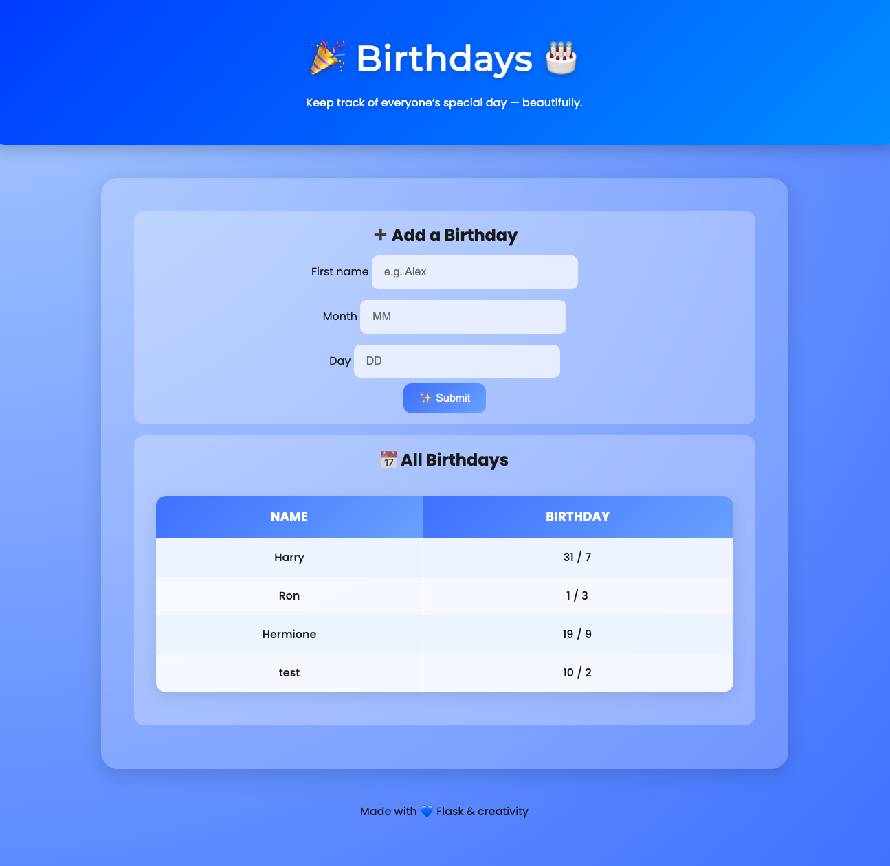

# 🎂 Birthday Tracker

A small Flask app for adding and viewing birthdays.  
It connects to an SQLite database and displays all entries in a simple, modern interface.

---

## 🖼 Preview



---

## ⚙️ Setup

```bash
git clone https://github.com/YOUR_USERNAME/birthday-tracker.git
cd birthday-tracker
pip install flask
flask run
```

---

## 📝 Usage

1. Open your browser and go to `http://127.0.0.1:5000/`.
2. Add a new birthday by filling out the form.
3. View all saved birthdays in the list below the form.

---

## 📁 Project Structure

```
birthday-tracker/
├── app.py
├── templates/
│   └── index.html
├── static/
│   └── styles.css
├── images/
│   └── home.png
├── birthdays.db
└── README.md
```

---

## 💡 Features

- Add new birthdays with name and date.
- View all saved birthdays.
- Simple, clean interface.

---

## 🛠 Tech Stack

- Python 3
- Flask
- SQLite
- HTML/CSS

---

## 🤝 Contributing

Contributions are welcome!  
Feel free to open issues or submit pull requests.

---

## 📄 License

This project is licensed under the MIT License.
